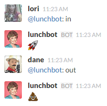

# lunchbot

lunchbot is a Slack bot that manages group lunch activity.

lunchbot keeps track of who buys lunch each day along with the cost of everybody's lunch, and maintains a running balance for each team member. When somebody pays off their debt, tell lunchbot and the balances will be adjusted accordingly.

lunchbot doesn't bother tracking who owes what to whom. Instead, it's treated as a single pool of money amongst the team. The people that buy lunch will show a positive balance reflecting the amount of money they're owed. The people that just order lunch without buying will show a negative balance reflecting the amount that they owe. As different people buy lunch, the balance shifts between them and, in the end, this provides a very simple way to minimize the number of times you actually have to exchange money.

lunchbot can also gather up orders from each person and provide a summary for whoever is placing the order.

Here's a [walkthrough](doc/walkthrough.md) on how to use lunchbot,  and you can always ask lunchbot for `help` to get a [list of commands](doc/commands.md).

lunchbot uses [`clj-slack-client`](https://github.com/tonyvanriet/clj-slack-client) to connect to the Slack Real Time Messaging and Web APIs.

## Usage

lunchbot is very much under development, though the basic functionality described above is working well. I'd love to have more people testing it out. If you're interested, drop me a note and I'd be happy to answer questions.

To run the bot, you'll have to [create a bot user](https://my.slack.com/services/new/bot) in Slack and put its API token in an `api-token.txt` file at the top-level of the project. Install [Leiningen](http://leiningen.org/) to assist with running the Clojure application. Then run the bot by executing `lein run` from within the project directory.

All of the commands issued to lunchbot are written out to the `events.edn` file, and lunchbot will be initialized from that file during startup. I intend to make that more robust in the future, but in the meantime, you might want to backup that file somehow.

I plan to add commands for adding and modifying restaurants but currently they are hard-coded in `command/parse.clj`.

## License

Copyright © 2015 Tony van Riet, Distributed under the MIT License
